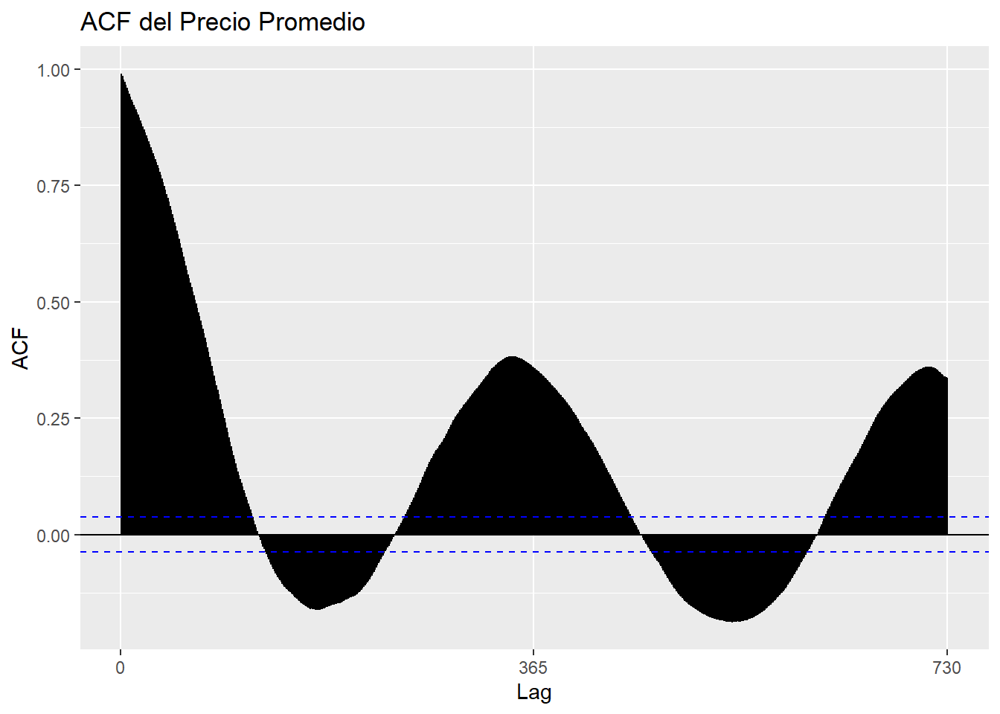

# EDA y Análisis de Series de tiempo

### **Cargue de Datos**


``` r
# Librerias

library(readr)
```

```
## Warning: package 'readr' was built under R version 4.3.3
```

``` r
library(dplyr)
```

```
## Warning: package 'dplyr' was built under R version 4.3.3
```

```
## 
## Attaching package: 'dplyr'
```

```
## The following objects are masked from 'package:stats':
## 
##     filter, lag
```

```
## The following objects are masked from 'package:base':
## 
##     intersect, setdiff, setequal, union
```

``` r
library(lubridate)
```

```
## Warning: package 'lubridate' was built under R version 4.3.3
```

```
## 
## Attaching package: 'lubridate'
```

```
## The following objects are masked from 'package:base':
## 
##     date, intersect, setdiff, union
```

``` r
library(ggplot2)
library(forecast)
```

```
## Warning: package 'forecast' was built under R version 4.3.3
```

```
## Registered S3 method overwritten by 'quantmod':
##   method            from
##   as.zoo.data.frame zoo
```

``` r
library(tseries)
```

```
## Warning: package 'tseries' was built under R version 4.3.3
```


### **Cargue de datos**


``` r
# Cargar datos
data <- read_csv("C:/Users/Steba/OneDrive/Escritorio/kalimati_tarkari_dataset (2).csv", show_col_types = FALSE)
```

### **Análisis Exploratorio de Datos (EDA)**


``` r
# Vista previa de los datos
head(data)
```

```
## # A tibble: 6 × 7
##      SN Commodity           Date       Unit  Minimum Maximum Average
##   <dbl> <chr>               <date>     <chr>   <dbl>   <dbl>   <dbl>
## 1     0 Tomato Big(Nepali)  2013-06-16 Kg         35      40    37.5
## 2     1 Tomato Small(Local) 2013-06-16 Kg         26      32    29  
## 3     2 Potato Red          2013-06-16 Kg         20      21    20.5
## 4     3 Potato White        2013-06-16 Kg         15      16    15.5
## 5     4 Onion Dry (Indian)  2013-06-16 Kg         28      30    29  
## 6     5 Carrot(Local)       2013-06-16 Kg         30      35    32.5
```


``` r
# comando para saber el tipo de datos
str(data)
```

```
## spc_tbl_ [197,161 × 7] (S3: spec_tbl_df/tbl_df/tbl/data.frame)
##  $ SN       : num [1:197161] 0 1 2 3 4 5 6 7 8 9 ...
##  $ Commodity: chr [1:197161] "Tomato Big(Nepali)" "Tomato Small(Local)" "Potato Red" "Potato White" ...
##  $ Date     : Date[1:197161], format: "2013-06-16" "2013-06-16" ...
##  $ Unit     : chr [1:197161] "Kg" "Kg" "Kg" "Kg" ...
##  $ Minimum  : num [1:197161] 35 26 20 15 28 30 6 30 35 25 ...
##  $ Maximum  : num [1:197161] 40 32 21 16 30 35 10 35 40 30 ...
##  $ Average  : num [1:197161] 37.5 29 20.5 15.5 29 32.5 8 32.5 37.5 27.5 ...
##  - attr(*, "spec")=
##   .. cols(
##   ..   SN = col_double(),
##   ..   Commodity = col_character(),
##   ..   Date = col_date(format = ""),
##   ..   Unit = col_character(),
##   ..   Minimum = col_double(),
##   ..   Maximum = col_double(),
##   ..   Average = col_double()
##   .. )
##  - attr(*, "problems")=<externalptr>
```


``` r
# Resumen estadístico de los datos
summary(data)
```

```
##        SN          Commodity              Date                Unit          
##  Min.   :     0   Length:197161      Min.   :2013-06-16   Length:197161     
##  1st Qu.: 49290   Class :character   1st Qu.:2015-08-24   Class :character  
##  Median : 98580   Mode  :character   Median :2017-08-03   Mode  :character  
##  Mean   : 98580                      Mean   :2017-08-09                     
##  3rd Qu.:147870                      3rd Qu.:2019-08-27                     
##  Max.   :197160                      Max.   :2021-05-13                     
##     Minimum           Maximum           Average       
##  Min.   :   1.00   Min.   :   6.00   Min.   :   5.00  
##  1st Qu.:  40.00   1st Qu.:  45.00   1st Qu.:  42.50  
##  Median :  60.00   Median :  70.00   Median :  65.00  
##  Mean   :  85.42   Mean   :  94.16   Mean   :  89.79  
##  3rd Qu.: 100.00   3rd Qu.: 110.00   3rd Qu.: 105.00  
##  Max.   :1800.00   Max.   :2000.00   Max.   :1900.00
```


``` r
# Verificar valores faltantes
sum(is.na(data))
```

```
## [1] 0
```

No se observan datos faltantes en el dataset


``` r
# Verificar datos duplicados
sum(duplicated(data))
```

```
## [1] 0
```
No se observan datos duplicados en el dataset

### **análisis Univariado**


``` r
# Distribución de precios promedio

ggplot(data, aes(x = Average)) +
  geom_histogram(binwidth = 5, fill = "blue", color = "black", alpha = 0.7) +
  labs(title = "Distribución de Precios Promedio", x = "Precio Promedio", y = "Frecuencia") +
  theme_minimal()
```


``` r
# Estadísticas descriptivas de precios promedio
data %>%
  summarise(
    Mean = mean(Average),
    Median = median(Average),
    SD = sd(Average),
    Min = min(Average),
    Max = max(Average)
  )
```

```
## # A tibble: 1 × 5
##    Mean Median    SD   Min   Max
##   <dbl>  <dbl> <dbl> <dbl> <dbl>
## 1  89.8     65  79.6     5  1900
```

### **Análisis Bivariado**


``` r
# Relación entre precio mínimo y precio máximo
ggplot(data, aes(x = Minimum, y = Maximum)) +
  geom_point(alpha = 0.5) +
  labs(title = "Relación entre Precio Mínimo y Máximo", x = "Precio Mínimo", y = "Precio Máximo") +
  theme_minimal()
```


``` r
# Correlación entre precio mínimo y precio máximo
cor(data$Minimum, data$Maximum)
```

```
## [1] 0.9950614
```

### **Análisis de Series de Tiempo**

### Filtrar 3 items


``` r
# Filtrar datos para un solo commodity
potatored_ts <- data %>% filter(Commodity == "Potato Red")
```


``` r
# autoplot de la serie de tiempo del precio promedio

autoplot(ts(potatored_ts$Average, frequency = 365, start = c(2013, 1))) +
  labs(title = "Serie de Tiempo: Precio Promedio de Papa Roja", y = "Precio Promedio") +
  theme_minimal()
```


``` r
autoplot(decompose(ts(potatored_ts$Average, frequency = 365, start = c(2013, 1))))
```


``` r
ggseasonplot(ts(potatored_ts$Average, frequency = 365, start = c(2013, 1)), year.labels=TRUE, year.labels.left=TRUE) +
  labs(title = "Seasonal Plot: Precio Promedio", y = "Precio Promedio") +
  theme_minimal()
```


``` r
ggsubseriesplot(ts(potatored_ts$Average, frequency = 365, start = c(2013, 1))) +
  labs(title = "Subseries Plot: Precio Promedio", y = "Precio Promedio") +
  theme_minimal()
```


``` r
ggAcf(ts(potatored_ts$Average, frequency = 365, start = c(2013, 1)), main = "ACF del Precio Promedio")
```

```
## Warning in ggplot2::geom_segment(lineend = "butt", ...): Ignoring unknown
## parameters: `main`
```




``` r
decompose(ts_data <- ts(potatored_ts$Average, frequency = 365, start = c(2013, 1))
)$trend %>% autoplot() + labs(title = "Tendencia del Precio Promedio", y = "Tendencia") + theme_minimal()
```


``` r
decompose(ts_data <- ts(potatored_ts$Average, frequency = 365, start = c(2013, 1))
)$seasonal %>% autoplot() + labs(title = "Estacionalidad del Precio Promedio", y = "Estacionalidad") + theme_minimal()
```


