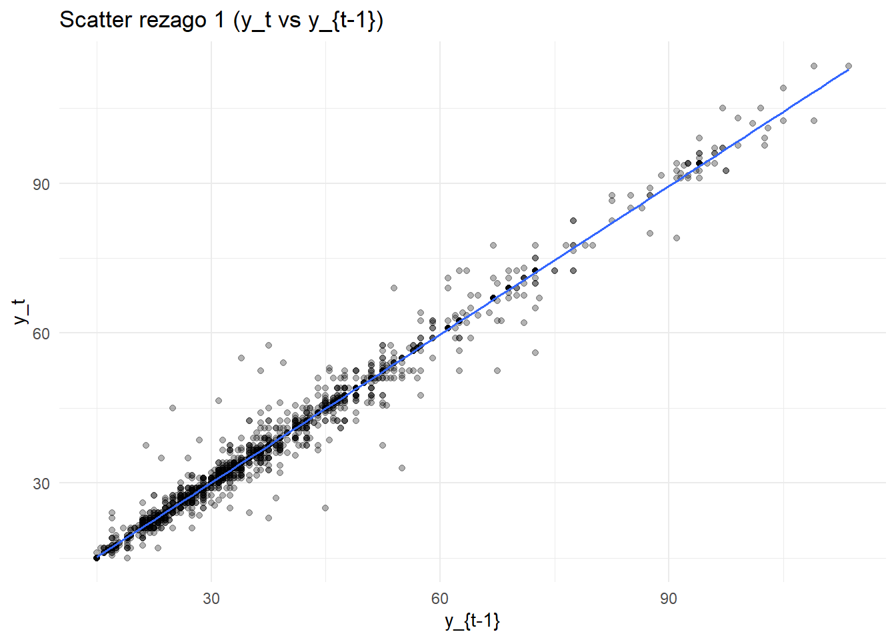

# EDA y Análisis de Series de tiempo

### **Cargue de Datos**


``` r
# Librerias (base originales + necesarias)

library(readr)
library(dplyr)
library(lubridate)
library(ggplot2)
library(forecast)
library(tseries)
library(here)    # rutas reproducibles
library(tidyr)   # regularizar fechas (complete)
library(slider)  # promedios moviles
```

Realizaremos nuestro analisis con un conjunto de datos de precios agrícolas proveniente del mercado de Kalimati (Nepal). Este dataset incluye información diaria sobre productos agrícolas, sus precios mínimos, máximos y promedio. A partir de estos datos se realizará un análisis exploratorio y un estudio de comportamiento temporal de los precios.


``` r
csv_file <- "C:/Users/Steba/OneDrive/Escritorio/kalimati_tarkari_dataset (2).csv"
```


``` r
# Leer datos

data_raw <- readr::read_csv(csv_file, show_col_types = FALSE)

# Estandarizar nombres a snake para facilitar mapeo

nms <- tolower(gsub("[^a-zA-Z0-9]+", "_", names(data_raw)))

# Intentar mapear columnas canonicas (Commodity / Date / Minimum / Maximum / Average)

df <- data_raw
names(df) <- nms

# Mapeo flexible (case-insensitive)

pick_first <- function(cands) {
hit <- intersect(cands, names(df))
if (length(hit) == 0) return(NA_character_) else return(hit[1])
}

col_commodity <- pick_first(c("commodity","item","product","variety","name"))
col_date      <- pick_first(c("date","fecha","day"))
col_min       <- pick_first(c("minimum","min","min_price","price_min"))
col_max       <- pick_first(c("maximum","max","max_price","price_max"))
col_avg       <- pick_first(c("average","avg","avg_price","price_avg","mean_price"))

req <- c(col_commodity, col_date, col_min, col_max, col_avg)

if (any(is.na(req))) {
stop("No fue posible mapear columnas clave (commodity/date/min/max/average). Revisa nombres del CSV: ",
paste(names(df), collapse = ", "))
}

data <- df %>%
transmute(
Commodity = .data[[col_commodity]],
Date      = as.Date(.data[[col_date]]),
Unit      = NA_character_,                 # si no existe, queda NA (no se usa en el analisis)
Minimum   = as.numeric(.data[[col_min]]),
Maximum   = as.numeric(.data[[col_max]]),
Average   = as.numeric(.data[[col_avg]])
)

# Chequeos basicos

stopifnot(inherits(data$Date, "Date"))
```

### **Primera Visualización de los datos**

``` r
# Vista previa y estructura

head(data)
```

```
## # A tibble: 6 × 6
##   Commodity           Date       Unit  Minimum Maximum Average
##   <chr>               <date>     <chr>   <dbl>   <dbl>   <dbl>
## 1 Tomato Big(Nepali)  2013-06-16 <NA>       35      40    37.5
## 2 Tomato Small(Local) 2013-06-16 <NA>       26      32    29  
## 3 Potato Red          2013-06-16 <NA>       20      21    20.5
## 4 Potato White        2013-06-16 <NA>       15      16    15.5
## 5 Onion Dry (Indian)  2013-06-16 <NA>       28      30    29  
## 6 Carrot(Local)       2013-06-16 <NA>       30      35    32.5
```

``` r
str(data)
```

```
## tibble [197,161 × 6] (S3: tbl_df/tbl/data.frame)
##  $ Commodity: chr [1:197161] "Tomato Big(Nepali)" "Tomato Small(Local)" "Potato Red" "Potato White" ...
##  $ Date     : Date[1:197161], format: "2013-06-16" "2013-06-16" ...
##  $ Unit     : chr [1:197161] NA NA NA NA ...
##  $ Minimum  : num [1:197161] 35 26 20 15 28 30 6 30 35 25 ...
##  $ Maximum  : num [1:197161] 40 32 21 16 30 35 10 35 40 30 ...
##  $ Average  : num [1:197161] 37.5 29 20.5 15.5 29 32.5 8 32.5 37.5 27.5 ...
```

``` r
summary(data)
```

```
##   Commodity              Date                Unit              Minimum       
##  Length:197161      Min.   :2013-06-16   Length:197161      Min.   :   1.00  
##  Class :character   1st Qu.:2015-08-24   Class :character   1st Qu.:  40.00  
##  Mode  :character   Median :2017-08-03   Mode  :character   Median :  60.00  
##                     Mean   :2017-08-09                      Mean   :  85.42  
##                     3rd Qu.:2019-08-27                      3rd Qu.: 100.00  
##                     Max.   :2021-05-13                      Max.   :1800.00  
##     Maximum           Average       
##  Min.   :   6.00   Min.   :   5.00  
##  1st Qu.:  45.00   1st Qu.:  42.50  
##  Median :  70.00   Median :  65.00  
##  Mean   :  94.16   Mean   :  89.79  
##  3rd Qu.: 110.00   3rd Qu.: 105.00  
##  Max.   :2000.00   Max.   :1900.00
```

### **Datos faltantes y duplicados**


``` r
# NAs y duplicados generales

sum(is.na(data))
```

```
## [1] 197161
```

``` r
sum(duplicated(data))
```

```
## [1] 0
```

### **Análisis Univariado**

``` r
#analisis univariado

ggplot(data, aes(x = Average)) +
geom_histogram(binwidth = 5, fill = "blue", color = "black", alpha = 0.7) +
labs(title = "Distribucion de Precios Promedio", x = "Precio Promedio", y = "Frecuencia") +
theme_minimal()
```


``` r
data %>%
summarise(
Mean = mean(Average, na.rm = TRUE),
Median = median(Average, na.rm = TRUE),
SD = sd(Average, na.rm = TRUE),
Min = min(Average, na.rm = TRUE),
Max = max(Average, na.rm = TRUE)
)
```

```
## # A tibble: 1 × 5
##    Mean Median    SD   Min   Max
##   <dbl>  <dbl> <dbl> <dbl> <dbl>
## 1  89.8     65  79.6     5  1900
```

### **Análisis Bivariado**


``` r
#analisis bivariado

ggplot(data, aes(x = Minimum, y = Maximum)) +
geom_point(alpha = 0.5) +
labs(title = "Relacion entre Precio Minimo y Maximo", x = "Precio Minimo", y = "Precio Maximo") +
theme_minimal()
```


### **Correlación de los datos**

``` r
cor(data$Minimum, data$Maximum, use = "complete.obs")
```

```
## [1] 0.9950614
```

## **Analisis de series de tiempo**


``` r
if ("Potato Red" %in% unique(data$Commodity)) {
target_item <- "Potato Red"
} else {
target_item <- data %>%
count(Commodity, sort = TRUE) %>%
slice(1) %>%
pull(Commodity)
}

target_item
```

```
## [1] "Potato Red"
```


``` r
# Filtrar y regularizar serie diaria

potatored <- data %>%
filter(Commodity == target_item) %>%
select(Date, Average) %>%
group_by(Date) %>%
summarise(Average = mean(Average), .groups = "drop") %>%
complete(Date = seq(min(Date, na.rm = TRUE), max(Date, na.rm = TRUE), by = "day")) %>%
arrange(Date)

# Construir objeto ts (diario, 365)

pot_ts <- ts(
potatored$Average,
start = c(lubridate::year(min(potatored$Date, na.rm = TRUE)),
lubridate::yday(min(potatored$Date, na.rm = TRUE))),
frequency = 365
)
```

### **Serie basica y ACF**


``` r
autoplot(pot_ts) +
labs(title = "Serie de tiempo: precio promedio", y = "Precio promedio") +
theme_minimal()
```


``` r
ggAcf(pot_ts) + labs(title = "ACF del precio promedio (diario)")
```


### **Promedios moviles (evidencia de suavizado)**


``` r
pot_ma <- potatored %>%
  mutate(
    ma7  = slide_dbl(Average, mean, .before = 6,  .complete = TRUE),
    ma30 = slide_dbl(Average, mean, .before = 29, .complete = TRUE)
  )

ggplot(pot_ma, aes(Date, Average)) +
  geom_line(linewidth = 0.5, alpha = 0.6) +
  geom_line(aes(y = ma7),  linewidth = 0.8) +
  geom_line(aes(y = ma30), linewidth = 0.9) +
  labs(title = "Serie y promedios moviles (7 y 30 dias)",
       x = "Fecha", y = "Precio promedio") +
  theme_minimal()
```


### **Rezagos (lags) y dependencia temporal**


``` r
pot_lags <- potatored %>%
  mutate(
    lag1  = dplyr::lag(Average, 1),
    lag7  = dplyr::lag(Average, 7),
    lag30 = dplyr::lag(Average, 30)
  )

# Scatter y_t vs y_{t-1}
ggplot(pot_lags, aes(lag1, Average)) +
  geom_point(alpha = 0.3) +
  geom_smooth(method = "lm", se = FALSE, linewidth = 0.7) +
  theme_minimal() +
  labs(title = "Scatter rezago 1 (y_t vs y_{t-1})", x = "y_{t-1}", y = "y_t")
```



``` r
# Scatter y_t vs y_{t-7}
ggplot(pot_lags, aes(lag7, Average)) +
  geom_point(alpha = 0.3) +
  geom_smooth(method = "lm", se = FALSE, linewidth = 0.7) +
  theme_minimal() +
  labs(title = "Scatter rezago 7 (aprox. semanal)", x = "y_{t-7}", y = "y_t")
```


``` r
# ACF/PACF (serie regularizada)

ggAcf(pot_ts)  + labs(title = "ACF precio promedio (diario)")
```


``` r
ggPacf(pot_ts) + labs(title = "PACF precio promedio (diario)")
```


### **Estacionalidad (descomposicion STL)**


``` r
fit_stl <- stl(na.interp(pot_ts), s.window = "periodic", robust = TRUE)
autoplot(fit_stl) + labs(title = "STL precio promedio")
```


El análisis de la serie temporal del precio promedio diario de Potato Red permitió evidenciar comportamientos consistentes con los fenómenos propios de los productos agrícolas de consumo masivo.
En primer lugar, los gráficos de tendencia y promedios móviles muestran que los precios presentan fluctuaciones periódicas pero con una ligera tendencia creciente en el largo plazo. El promedio móvil de 7 días suaviza las variaciones diarias y deja entrever ciclos semanales asociados a la oferta en el mercado, mientras que el promedio de 30 días resalta un patrón más estructural que apunta a incrementos graduales, posiblemente relacionados con factores estacionales como la disponibilidad de cosecha o la variación de costos logísticos.

El estudio de rezagos (lag 1, lag 7 y lag 30) refuerza esta observación: las gráficas de dispersión muestran una clara autocorrelación positiva, especialmente para rezagos cortos, indicando que los precios actuales dependen directamente de los valores recientes. Este comportamiento sugiere persistencia temporal: cuando los precios aumentan o disminuyen, tienden a mantener esa dirección durante varios días, lo cual es característico de mercados donde la información y las condiciones de oferta no cambian abruptamente.

La función de autocorrelación (ACF) confirma esta dependencia temporal, con correlaciones significativas en los primeros rezagos que luego disminuyen de forma progresiva. Esto demuestra que la serie no sigue un comportamiento completamente aleatorio, sino que existen patrones repetitivos en el tiempo.

La descomposición STL separó la serie en sus componentes de tendencia, estacionalidad y residuo. Los resultados muestran una estacionalidad marcada con ciclos anuales definidos: los precios tienden a elevarse en ciertas épocas del año y disminuir en otras, reflejando los periodos de cosecha y escasez. La tendencia general es estable con una leve inclinación al alza, mientras que los residuos mantienen una magnitud baja y no presentan patrones visibles, lo que indica que gran parte de la variabilidad del precio está explicada por la tendencia y la estacionalidad, sin presencia de choques exógenos significativos.

En conjunto, estos hallazgos evidencian que la serie del precio promedio de Potato Red posee un comportamiento no estacionario, con una tendencia creciente y estacionalidad recurrente, pero sin irregularidades fuertes.
El patrón identificado sugiere que los precios pueden modelarse de forma confiable mediante técnicas de suavizado exponencial o modelos ARIMA estacionales, una vez que se realicen las transformaciones necesarias para estabilizar la media y la varianza. En términos prácticos, los resultados reflejan que el mercado analizado responde a ciclos previsibles, lo cual facilita la planificación de precios, abastecimiento y estrategias de comercialización.

### **Estacionariedad y diferenciación**

**Introducción**
En esta segunda parte se busca analizar si la serie de tiempo seleccionada (Potato Red) cumple con el supuesto de estacionariedad. Una serie estacionaria es aquella cuya media y varianza permanecen constantes en el tiempo.
En caso de que no sea estacionaria, se aplicarán procedimientos de diferenciación # o transformación para estabilizar la tendencia y la variabilidad.


``` r
# Usaremos una version "limpia" de la serie via interpolacion lineal base R, partimos de 'potatored' (data.frame terminado) y/o de 'pot_ts' (ts original)

y <- as.numeric(pot_ts)

if (anyNA(y)) {
  idx_ok <- which(!is.na(y))
  y_interp <- approx(x = idx_ok, y = y[idx_ok], xout = seq_along(y))$y
} else {
  y_interp <- y}


pot_ts_clean <- ts(
  y_interp,
  start = start(pot_ts),
  frequency = frequency(pot_ts)
)
```


### **Verificación de estacionariedad (ADF Test)**


``` r
# Prueba de raíz unitaria de Dickey-Fuller aumentada

adf_result <- adf.test(pot_ts_clean)
adf_result
```

```
## 
## 	Augmented Dickey-Fuller Test
## 
## data:  pot_ts_clean
## Dickey-Fuller = -3.0587, Lag order = 14, p-value = 0.1301
## alternative hypothesis: stationary
```

``` r
# al tener en el ADF inicial: p = 0.1301 → se concluye que es no estacionaria al nive, por lo cual procedemos con transformacion y diferenciacion en escalones


# Serie base a usar en esta etapa y verificamos que no tenga na ni valores negativos
y0 <- pot_ts_clean 
sum(is.na(y0))
```

```
## [1] 0
```

``` r
all(y0>0)
```

```
## [1] TRUE
```

``` r
y_log <- log(y0)
range(y0, na.rm = TRUE); range(y_log, na.rm = TRUE)  # solo para verificar el cambio de escala
```

```
## [1]  15.0 113.5
```

```
## [1] 2.708050 4.731803
```

``` r
adf_log <- adf.test(y_log)
adf_log$p.value
```

```
## [1] 0.1322035
```
La transformación logarítmica ayudó a homogeneizar la variabilidad, pero no eliminó la tendencia ni la dependencia temporal. La serie transformada sigue teniendo raíz unitaria, por lo que pasamos a una diferenciacion de primer orden (d=1) sobre la serie logaritmica y volvemos a probar estacionariedad.


``` r
y_diff1 <- diff(y_log, differences = 1)
adf_diff1 <- tseries::adf.test(na.omit(y_diff1))
adf_diff1$p.value
```

```
## [1] 0.01
```
con este resultado podemos concluir que:

* La serie original no era estacionaria (p = 0.1301).

* La serie logarítmica tampoco lo fue (p = 0.1322), aunque esa transformación ayudó a estabilizar la varianza 

* Al aplicar una diferencia de primer orden sobre la serie logarítmica, la prueba ADF arrojó p = 0.01, es decir < 0.05, por lo tanto sí es estacionaria.


### **Interpretacion**

Luego de aplicar la transformación logarítmica, la serie mantuvo la misma tendencia general, por lo que no se logró estacionariedad. Sin embargo, al diferenciarla una vez (d = 1), la prueba de Dickey–Fuller aumentada mostró un p-valor de 0.01, lo que indica que se rechaza la hipótesis nula de raíz unitaria. En consecuencia, la serie diferenciada es estacionaria.

Este resultado implica que la tendencia determinista fue eliminada mediante la primera diferencia, estabilizando la media a lo largo del tiempo. Por otro lado, la transformación logarítmica permitió controlar la heterocedasticidad, de modo que las fluctuaciones de la serie ahora son de magnitud comparable. La combinación de ambos pasos —logaritmo y diferencia de primer orden— produce una serie adecuada para modelar mediante métodos lineales, como los modelos ARIMA o SARIMA.

Visualmente, la serie diferenciada oscila alrededor de cero y las funciones de autocorrelación (ACF y PACF) se estabilizan rápidamente, lo que refuerza la evidencia de estacionariedad.
